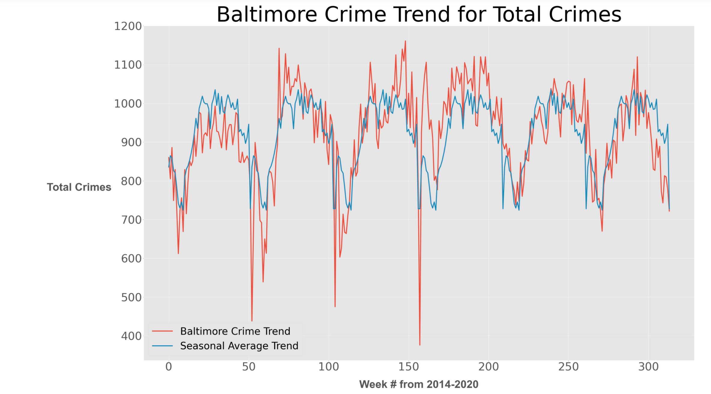
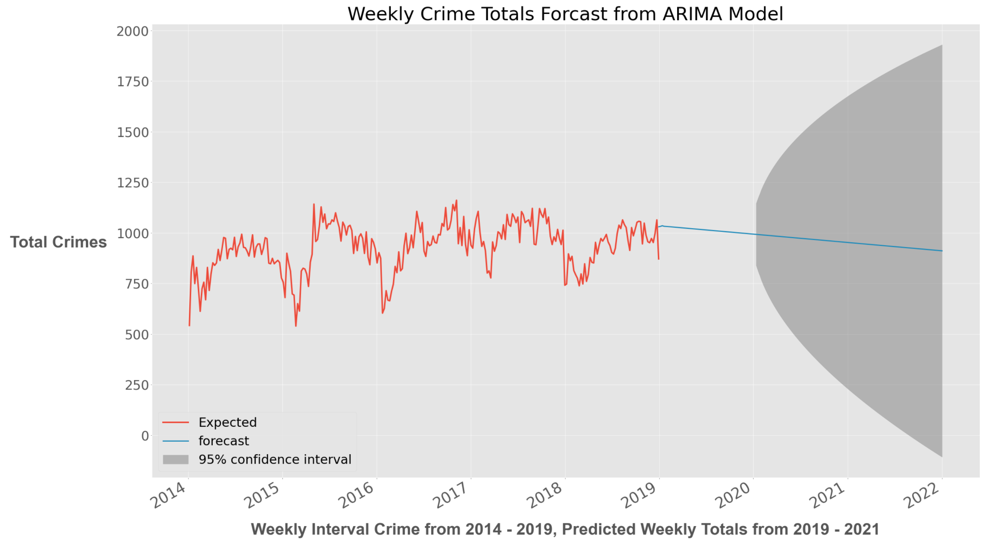
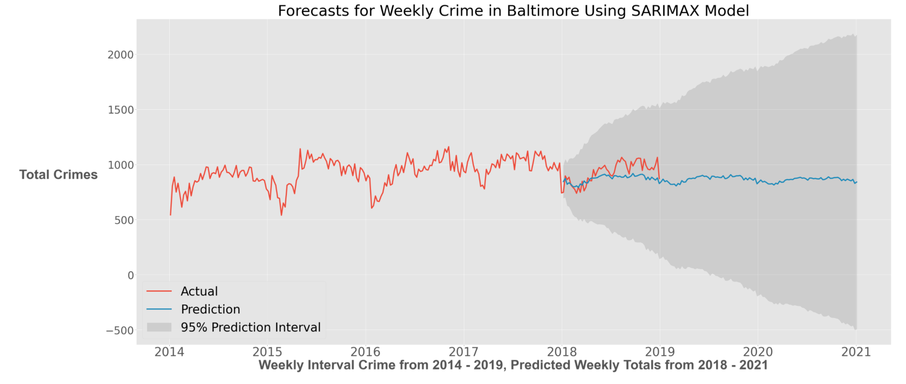

# Predicting Crime in Baltimore
Using machine learning to forecast the Total Crime in Baltimore.

## Why Crime in Baltimore?
Ever since watching HBO's The Wire, I have been fascinated with Baltimore crime. Crime effects not only the people who live in the city, but the city workers as well. As someone who hopes to better our current law enforcement, I decided that attempting to predict total number of crimes would be a good exercise in using time series. Baltimore Police Department's Crime Dataset (1957-2020)

## Data Acquisition
__Dataset__:
    I sourced the crime data from Baltimore Police Department's [crime database](https://data.baltimorecity.gov/Public-Safety/BPD-Part-1-Victim-Based-Crime-Data/wsfq-mvij). Each row contains relevant crime information (date, time, crime type, neighborhood, etc...). The Crime dataset I started with was CSV formatted which was perfect since it would be easily read into a pandas dataframe. 

Weekly-Trend-Graph:

